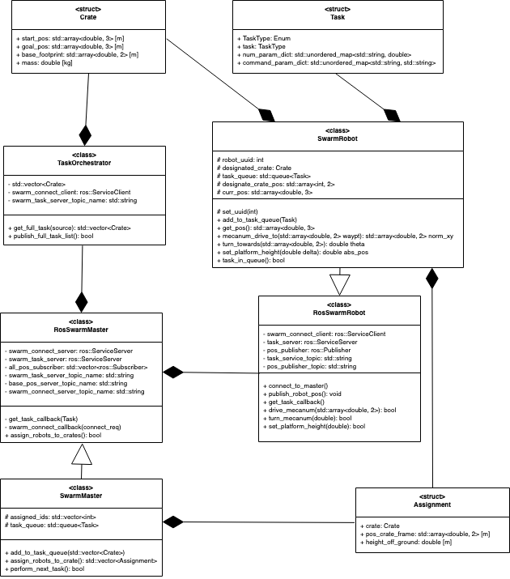

# Swarm-Automation-for-Warehouses

## Overview

The aim of the project is to implement a soultion for automation of warehouses using robot swarms. We have chosen to implement Ackermann steering for many of its advantages. The most important one is that it does not slip in higher velocities, this is achieved by steering the  inside  wheel at a greater angle than the outside wheel.This is very crucial as it ensures longevity of the the wheels and that the rover is stable and controllable.

The following assumptions are made while developing this project :-

  1. Individual robot in the swarm can bear the given load and carry it to the respective target. 
  2. Terrain and map of the warehouse is known to the swarm master. 
  3. The communication between the robots happens without any breaks and the position broadcast by the robot is accurate to $10^{-1}$ units. 
  4. There will be no failure in the in the pickup process and we expect the robots will carry the object all the way to the object's location. 
  5. Clearance of 1 unit from any obstacle. 
  6. No slippage between the wheel and motor shaft and the whole system will have the same RPM. 
  7. The a heavier object will have a size that is wide enough to accommodate the required number of robots to lift it.
  8. 
  
## Agile Iterative Process (AIP)
This project will be completed using AIP with the involvement of 3 programmers using Pair-programming with a design keeper in turns. The detailed Product Backlog, Iteration Backlogs and Work Log are mentioned in the link given below :

[Agile Iterative Process](https://docs.google.com/spreadsheets/d/1AiBJ7fTTMpNdjacxr-WVjDRh2hcvcvK_cOTTBANr-Ac/edit#gid=0)

[Google Doc Link forDesign and Planning notes](https://docs.google.com/document/d/1R9V4Kxqv8dNjsHtDVxABXgzMm4t1GjswrSu_oFk5m9A/edit?usp=sharing)

The initial activity diagram is here below

The initial UML is here below

## Important Links

<!-- [Proposal Phase-0](https://drive.google.com/file/d/1umYMgm8mL1ALpWycH2YrRFYiQv6a0TN-/view?usp=sharing)

[Proposal Phase-1 Update](https://drive.google.com/file/d/1YsaQfGZgOE7c7Dwa6bHzNXLxi3fZrg2r/view)

[Proposal Phase-2 Update](https://drive.google.com/file/d/1H7cM33AkOMfr0ANB2vwNEoRtOkwhLxyO/view?usp=sharing)

[Quad Chart Phase-0](https://drive.google.com/file/d/1-h-sLWbmNeX7z31qwRXdcSlXcgGUWfXG/view?usp=sharing)

[UML Diagram](https://drive.google.com/file/d/1Zu3fTrS95gYpkMdT5xp2CJ424eM1xON7/view?usp=sharing)

[UML Diagram Phase 1](https://drive.google.com/file/d/183aDx3iQR4v4fukx3KLp-rI0bn9yGZ4i/view?usp=sharing)

[UML Diagram Phase 2](https://drive.google.com/file/d/1sYCCHkBEKD8TA1m3nXA8TqwH6car5CTh/view?usp=sharing)

[ Youtube link to the Proposal](https://youtu.be/cgePebQyXTI)

[ Youtube link to the Phase 1](https://youtu.be/n60_Hbyo3_k)

[ Youtube link to the Phase 2](https://youtu.be/ieRox915Phw) -->
